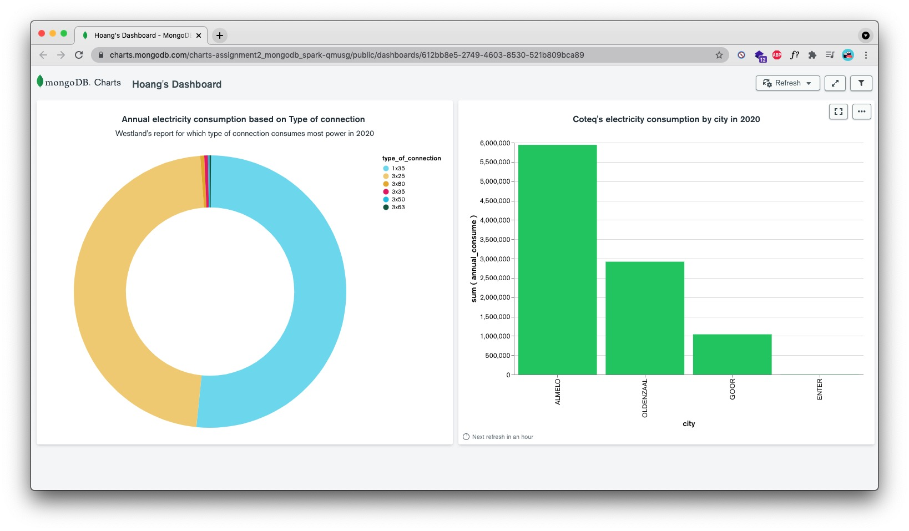

# Data Pipeline using Spark, MongoDB and MLflow

#### Table of Contents
* [About](#about)
* [Connect](#connect)

# About
This pipeline can be found in the notebook `hoang.ipynb`, consisting of the following tasks:
- Task 1: MongoDB
- Task 2: Data ingestion and data cleaning/transformation
- Task 3: Model training and tracking with data pipeline and MLflow
- Task 4: Visualisation

Final visualiaztion on MongoDB charts:

# Connect with me
* My [Website](https://hoangdesu.com/)
* My [LinkedIn](https://www.linkedin.com/in/hoangdesu/)
* My [Facebook](https://www.facebook.com/Hoangdayo/)
* My [Instagram](https://www.instagram.com/hoang.desu/)
* You can shoot me an [email](mailto:hoangdesu@gmail.com) too!

If you find this project useful, you can let me know. I would love to hear about it! 🍣
Notes: the model training with MLflow is incomplete.

